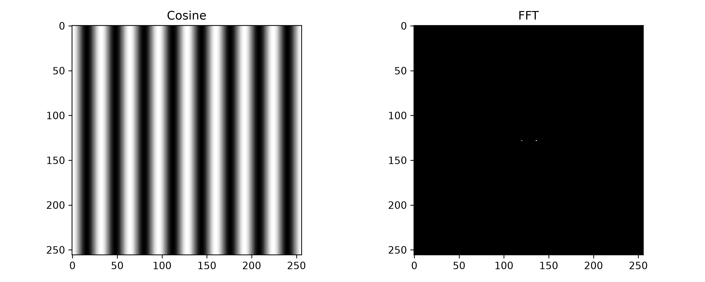
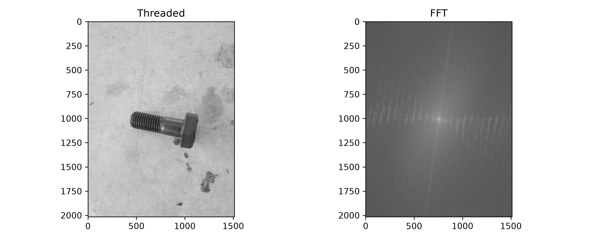
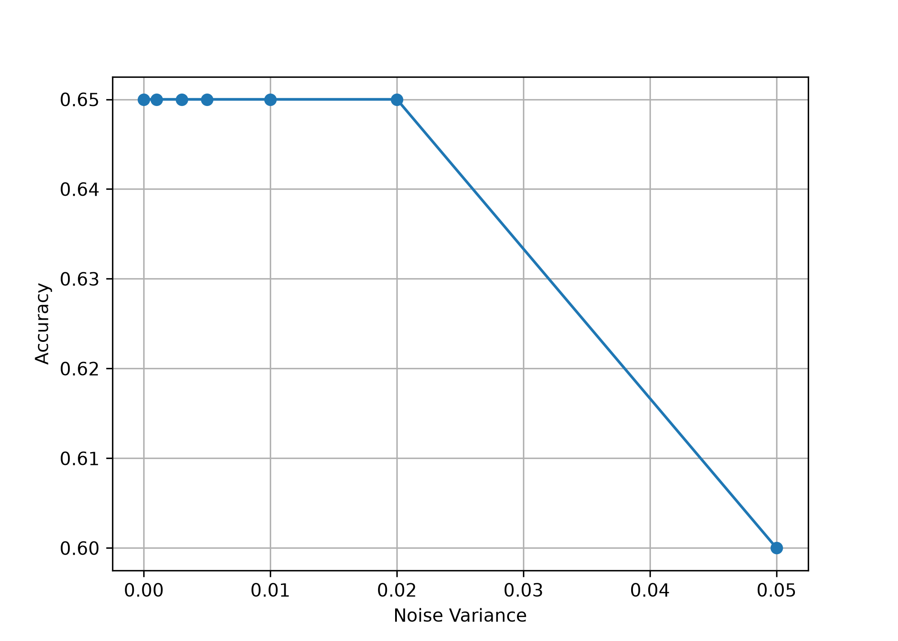

# Thread Detection Using FFT and Cosine Filter Bank

Image Processing Course Project

## Overview

This project implements a simple image-processing approach for distinguishing threaded and non-threaded screws using frequency-domain analysis.

The implementation follows the project requirements without using machine learning or deep learning methods. The main idea is that threaded screws contain periodic structures, which produce characteristic patterns in the Fourier domain.

---

## Objectives

- Generate a bank of cosine filters with different frequencies and orientations.
- Analyze the Fourier Transform of cosine images.
- Analyze the Fourier Transform of threaded and non-threaded screw images.
- Implement a simple FFT-based predictor.
- Evaluate the predictor under Gaussian noise.

---

## Project Structure

```
thread-detection/
│
├── data/
│   ├── threaded/
│   └── non_threaded/
│
├── outputs/
│
├── src/
│   ├── fft_detector.py
│   ├── filters.py
│   ├── image_utils.py
│   ├── predictor.py
│   └── noise_test.py
│
├── main.py
├── requirements.txt
├── README.md
└── .gitignore
```

---

## Requirements

Install the required packages:

```bash
pip install -r requirements.txt
```

---

## Running the Project

Run:

```bash
python main.py
```

---

# Methodology

## Part 1 – Cosine Filter Bank

A set of 2D cosine images was generated using different spatial frequencies and orientations.

Each cosine image was transformed using the 2D Fast Fourier Transform (FFT) to verify that periodic structures appear as two symmetric peaks in the frequency domain.

Example outputs:

<p align="center">

</p>

---

## Part 2 – FFT Analysis of Screw Images

Threaded and non-threaded screw images were converted to grayscale and transformed into the frequency domain.

The FFT magnitude spectrum was visualized after logarithmic scaling.

Example:

<p align="center">

</p>

Observation:

- Threaded screws exhibit stronger periodic frequency components.
- Non-threaded screws mainly contain low-frequency information.

---

## Part 3 – Thread Predictor

A simple predictor was implemented using the FFT spectrum.

Processing pipeline:

1. Read image
2. Convert to grayscale
3. Compute FFT
4. Shift FFT spectrum
5. Remove low-frequency center
6. Compute score from strongest FFT peaks
7. Compare score with a threshold

Prediction:

- 1 → Threaded
- 0 → Non-threaded

This approach does not use machine learning and relies only on classical image processing techniques.

---

## Part 4 – Noise Evaluation

Gaussian noise was added to the images using different variance values.

The predictor was evaluated on noisy images to study its robustness.

Example variances:

```
0
0.001
0.003
0.005
0.01
0.02
0.05
```

Accuracy was measured for each noise level.

Example plot:

<p align="center">

</p>

---

# Results

The implemented FFT-based predictor successfully distinguishes many threaded images from non-threaded images.

Although the method is intentionally simple, it demonstrates that periodic structures can be detected using frequency-domain analysis.

The predictor achieved approximately **65% classification accuracy** on the provided dataset.

---

# Technologies

- Python
- NumPy
- OpenCV
- Matplotlib

---

# Future Improvements

Possible improvements include:

- Better FFT feature extraction
- Automatic threshold estimation
- Rotation normalization
- Gabor filter bank
- Hough transform
- Gradient-based features

---

# Repository

Clone the project:

```bash
git clone https://github.com/m-mahdi-jafari-yazani/thread-detection.git
```

---

# Author

Mohammadmahdi Jafari Yazani

Image Processing Course Project